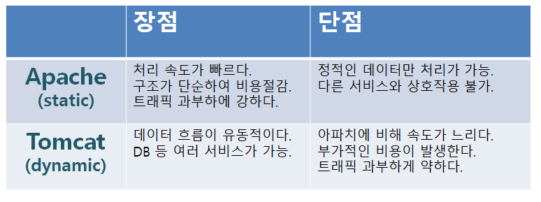
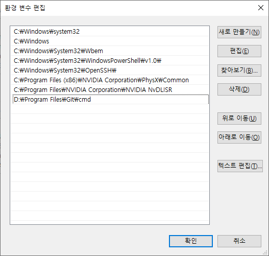

# Apache Tomcat
아파치 톰캣은 아파치+톰캣을 의미한다.
둘 다 웹 서버로 사용 할 수 있지만 사용목적이 약간씩 다르다.
* Apache  
아파치는 정적 웹 서버로 클라이언트에서 요청(POST, GET, PUT, DELETE)이 온 것만 응답한다.
HTML, CSS, 이미지 등의 정적인 처리만 담당한다.
* Tomcat  
톰캣은 다이나믹 웹 서버로 WAS(Web Application server) 동적인 웹 컨테이너를 제작하기 위해서 사용한다.
JSP, ASP, PHP 등의 동적 데이터를 톰캣에서 처리한다.

그렇다면 정적인 데이터까지 Tomcat에서 모두 처리하면 되지 않느냐? 라고 반문 할 수 있지만 상대적으로 속도면에서 느려서 요청이 많아 질 시 과부하가 걸릴 수 있다.
그리하여 모든 요청을 아파치 서버에서 받도록 설정하고 정적 컨테이너는 아파치가, 동적 컨테이너는 톰캣으로 보내 처리하는 구조를 사용한다.  
두 가지를 합쳐서 사용하므로 보통 아파치 톰캣으로 합쳐서 말하곤 한다.

아파치: 80포트
톰캣: 8080포트  
실제로는 아파치에서 데이터를 주고받으므로 80포트만 사용하고 아파치에서 톰캣으로 내부적으로 보낸다.


### Reference
[아파치 톰캣이란?](https://wodonggun.github.io/wodonggun.github.io/study/%EC%95%84%ED%8C%8C%EC%B9%98-%ED%86%B0%EC%BA%A3-%EC%B0%A8%EC%9D%B4.html)
[참고 자료](https://twiceagain.tistory.com/4)  
[아파치와 톰캣의 차이](https://limmmee.tistory.com/4)  
[WAS 구현](https://doitnow-man.tistory.com/111?category=726138)

# Apache 설치
1. 아파치 최신버전을 아래 링크에서 다운받는다.
https://www.apachelounge.com/download/
2. 아파치 최신버전은 VS16을 기반으로 되어 있으므로 VS16 재배포패키지를 먼저 설치해준다.
[VS16 재배포패키지](https://support.microsoft.com/ko-kr/help/2977003/the-latest-supported-visual-c-downloads)  

3. 아파치 최신버전 압축파일의 Apache24폴더를 서버를 설치할 곳에 압축을 푼다. 기본 권장루트는 C:\이다.
4. Apache24\conf\httpd.conf를 메모장 등 텍스트 에디터로 열어서 설정을 진행한다.
    1. 서버 루트 변경  
        Ctrl+F를 사용하여 "Define SRVROOT"를 검색하고 3번의 Apache24의 폴더 루트로 바꾼다.
        저는 같은 루트이므로 변경하지 않았습니다.  
        ```
        Define SRVROOT "C:/Apache24" → "Custom Root"
        ``` 
    2. 포트 변경(옵션, 불가피하게 포트를 변경해야 할 시)  
        Listen 80을 검색하여 80을 원하는 포트번호로 변경
        ```
       Listen 80 → "Custom port number"
       ```
    3. 웹문서 저장위치 변경  
        DocumentRoot를 검색하여 ${SRVROOT} 뒤의 내용을 원하는 위치로 변경  
        SRVROOT 내의 폴더가 아니라 다른 위치로 하고 싶다면 그 위치를 설정해도 무관하다.
        ```
        DocumentRoot "${SRVROOT}/htdocs" → "${SRVROOT}/Custom root"
        ```
    4. 서버 이름 변경  
        \#ServerName을 검색하여 #을 제거하고 localhost:80 또는 127.0.0.1:80으로 변경해준다.  
        이렇게 변경하면 외부 인터넷 망 없이도 내부 서버로 접속해서 홈페이지를 불러 올 수 있다.
        ii.번에서 포트를 변경했다면 80번을 변경한 포트번호로 변경해야 한다.
        ```
        #ServerName www.example.com:80 → ServerName localhost:80
       ``` 
5. 내 컴퓨터 오른쪽클릭 - 속성 - 고급 시스템 설정 - 고급탭 - 환경변수  
시스템 변수에서 Path 더블클릭 하면 아래와 같은 창을 볼 수 있습니다.  
새로 만들기 - Apache설치경로\bin 입력  


6. 윈도우버튼을 누르고 cmd를 입력하고 Ctrl+Shift+Enter를 입력하여 관리자모드로 연다.
    설치 명령어를 입력해서 아파치를 설치한다. 
    ```
    httpd -k install
    ```   
7. 시작 명령어를 쳐서 아파치를 실행하고, <http://localhost>를 입력하여 테스트한다.
    ```
    httpd -k start
   ```
8. 추가 명령어
    ```
   아파치 종료 <httpd -k stop>
   아파치 서비스 재시작 <http.exe -k restart>
   아파치 저비스 제거 <httpd.exe -k uninstall> or <httpd.exe -k unstall -n 서비스이름>
   ```


[아파치 설치과정 정리](https://jimnong.tistory.com/612)


