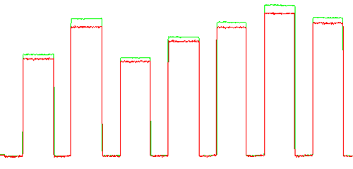
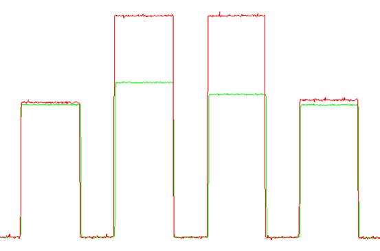

# Signal Level Correction
구형파를 필터링하여 signal level을 보정하는 알고리즘을 작성중이다.



두 가지 파형을 구분하고자 한다.

#### 존재하는 조건들
1. 장비 내부에서 사용하는 알고리즘이므로 사용 가능한 Tact time이 매우 짧다100ms~300ms정도
2. 전반적인 Slope를 알아내야 하면서도 중간에 에러(peak higher)와 구분해야 한다      

####선행된 개발내용   
1. Cutoff를 사용하여 Signal level 보정   
Cutoff를 사용하여 에러를 제거하고 전체적인 slope를 Gain화시켜 적용하였다.
그러나 결국 Error를 찾을 수 있다는 것은 이상적인 조건이다.
검사장비를 만드는 회사에서 최종 결과가 나오기 위한 알고리즘단에서 에러를 알 수 있는 방법은 없다.
2. Median filter를 이용하여 노이즈 제거   
61 window size를 가지는 median filter를 돌려서 Impulse성 노이즈들을 제거하려고 하였다.
그러나 window 내에 impulse가 여러개가 있을 경우 데이터인 구형파마저 없어지는 현상을 보이고 있다. - 수정이 필요함

## List
* [2020/4/7 - 구형파 Filtering]()

## Log
### 2020/4/7
사각파 혹은 구형파 라고 불리는 이 파형은 일정한 주기를 갖는 무수한 sin 파형의 합으로 이루어진다.
상대적으로 필터링을 할 때 sin형태의 파형보다 더 많은것을 고려하여 필터링해야 한다.
   
Reference signal과 Raw signal을 비교하여 Raw에 어떠한 offset을 가지고 있을 경우에 offset만을 추려내어 보정하려고 한다.
구형파(사각파)는 ~~수식~~ 으로 이루어져 있다. ```2k-1```의 주파수비율로 무한대 개수의 sin 파형이 존재하므로 완벽한 파형 제거가 불가능하다.  
* low pass filtering을 진행하고 감쇄율이 적용된 값을 사용하여 보정 할 수 있도록 한다.
* Filter만을 사용하는 것이 아니라 cutoff 도 좋은 방법이 될 수 있다. 두가지를 조합하여 사용하자.
