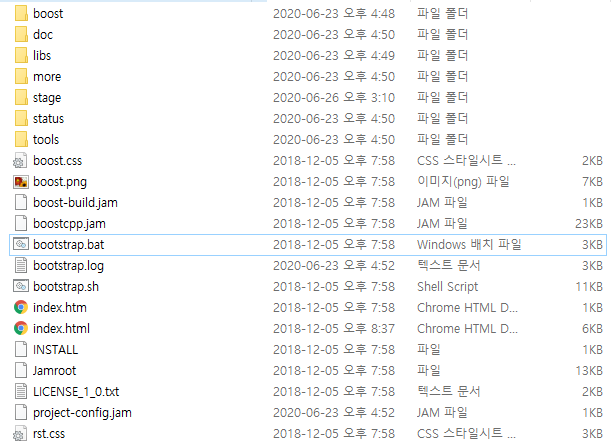

# Boost Librarys

Boost 라이브러리는 c++개발을 하면서 가장 많이 쓰는 라이브러리이면서 많은 사용자가 성능을 증명한 라이브러리기도 합니다.
더불어 Boost개발진들 중 상당수가 c++표준위원회에 속해 있어 c++의 새 표준이 발표 될 때 마다 Boost의 영향을 많이 받아 출시됩니다.

더불어 낮은 C++ 버전을 지원하는 IDE일 경우 Boost를 사용하여 미리 연습하고 적용 할 수 있습니다.

## Boost Library 설치 for windows
<https://www.boost.org/> 에서 라이브러리를 다운 받을 수 있습니다.  
20.06.26 현재 1.73 version까지 Release되었으나 설치 시 VS2017 Developer Command Prompt가 필요합니다.  
VS2010 환경을 써야하는 상황에서는 안전하게 1.69 version을 사용하였습니다.

zip파일의 압축을 풀게 되면 


여기서 ```Bootstrapt.bat```을 실행시키면 ```b2.exe```와 ```bjam.exe```가 생성됩니다.

```cmd``` 창을 켠 뒤 ```b2.exe```가 있는 폴더에 가서 설정 환경에 따라 입력해주고 컴파일합시다.
```shell script
$ b2 -j4 -a --toolset=msvc-10.0 variant=debug,release link=static threading=multi address-model=32
$ b2 -j4 -a --toolset=msvc-10.0 variant=debug,release link=static threading=multi address-model=64
```
기본적으로 Compile 한 결과로 ```./stage/lib``` 폴더에 있으니 32bit, 64bit 각각 컴파일 한 후 폴더이름을 바꿔줍시다.

만약 Visual C++을 쓰고 있다면 아래의 컴파일러 버전을 확인합니다.
```shell script
MSC    1.0   _MSC_VER == 100
MSC    2.0   _MSC_VER == 200
MSC    3.0   _MSC_VER == 300
MSC    4.0   _MSC_VER == 400
MSC    5.0   _MSC_VER == 500
MSC    6.0   _MSC_VER == 600
MSC    7.0   _MSC_VER == 700
MSVC++ 1.0   _MSC_VER == 800
MSVC++ 2.0   _MSC_VER == 900
MSVC++ 4.0   _MSC_VER == 1000 (Developer Studio 4.0)
MSVC++ 4.2   _MSC_VER == 1020 (Developer Studio 4.2)
MSVC++ 5.0   _MSC_VER == 1100 (Visual Studio 97 version 5.0)
MSVC++ 6.0   _MSC_VER == 1200 (Visual Studio 6.0 version 6.0)
MSVC++ 7.0   _MSC_VER == 1300 (Visual Studio .NET 2002 version 7.0)
MSVC++ 7.1   _MSC_VER == 1310 (Visual Studio .NET 2003 version 7.1)
MSVC++ 8.0   _MSC_VER == 1400 (Visual Studio 2005 version 8.0)
MSVC++ 9.0   _MSC_VER == 1500 (Visual Studio 2008 version 9.0)
MSVC++ 10.0  _MSC_VER == 1600 (Visual Studio 2010 version 10.0)
MSVC++ 11.0  _MSC_VER == 1700 (Visual Studio 2012 version 11.0)
MSVC++ 12.0  _MSC_VER == 1800 (Visual Studio 2013 version 12.0)
MSVC++ 14.0  _MSC_VER == 1900 (Visual Studio 2015 version 14.0)
MSVC++ 14.1  _MSC_VER == 1910 (Visual Studio 2017 version 15.0)
MSVC++ 14.11 _MSC_VER == 1911 (Visual Studio 2017 version 15.3)
MSVC++ 14.12 _MSC_VER == 1912 (Visual Studio 2017 version 15.5)
MSVC++ 14.13 _MSC_VER == 1913 (Visual Studio 2017 version 15.6)
MSVC++ 14.14 _MSC_VER == 1914 (Visual Studio 2017 version 15.7)
MSVC++ 14.15 _MSC_VER == 1915 (Visual Studio 2017 version 15.8)
MSVC++ 14.16 _MSC_VER == 1916 (Visual Studio 2017 version 15.9)
MSVC++ 14.2  _MSC_VER == 1920 (Visual Studio 2019 Version 16.0)
MSVC++ 14.21 _MSC_VER == 1921 (Visual Studio 2019 Version 16.1)
MSVC++ 14.22 _MSC_VER == 1922 (Visual Studio 2019 Version 16.2)
MSVC++ 14.23 _MSC_VER == 1923 (Visual Studio 2019 Version 16.3)
MSVC++ 14.24 _MSC_VER == 1924 (Visual Studio 2019 Version 16.4)
MSVC++ 14.25 _MSC_VER == 1925 (Visual Studio 2019 Version 16.5)
MSVC++ 14.26 _MSC_VER == 1926 (Visual Studio 2019 Version 16.6)
```

미리 컴파일 해 놓은 자료도 있네요 [Boost prebuild file](https://sourceforge.net/projects/boost/files/boost-binaries/)

## Boost library linking
```b2.exe```를 사용하여 Compile를 완료하면 Library를 어디다 linking해야 하는지 알려줍니다.
보통 boost root에 헤더파일이, boost/stage/lib에 lib파일이 있습니다.  
visual studio에서  아래와 같이 지정해줍니다.
```
추가 포함 디렉터리: %BOOST_1_69%
추가 라이브러리 디렉터리: %BOOST_1_69%\stage\lib32
``` 

여기서 사용한 ```%BOOST_1_69%```는 시스템 환경변수입니다. PC마다 boost의 위치가 다르니 환경변수로 대체하였습니다.    
환경변수 설정법은 
[여기](https://m.blog.naver.com/PostView.nhn?blogId=shwotjd14&logNo=221226368685&proxyReferer=https:%2F%2Fwww.google.com%2F)
나
[여기](https://booolean.tistory.com/403)
를 참조해주세요.

## Boost library test
간단하게 ```boost::thread```를 이용하여 동작 테스트만 하겠습니다.
```cpp
#include "stdafx.h"
#include <iostream>
#include <boost/thread.hpp>

void workerThreadFunc(int count);

int _tmain(int argc, _TCHAR* argv[])
{
	boost::thread boostWorkerThread(workerThreadFunc, 10);
	boostWorkerThread.join();

	return 0;
}

void workerThreadFunc(int count)
{
	for( int i = 0; i < count; ++i)
	{
		std::cout << i << " Thread count\n";
	}
}
```

## Reference
* [윈도우10 Boost 최신버전 설치 및 사용법](https://wendys.tistory.com/115)
* [VS2010에서 사용 할 수 있는 Boost 버전](https://smok95.tistory.com/290)
* [MSVC version check](https://en.wikipedia.org/wiki/Microsoft_Visual_C%2B%2B)